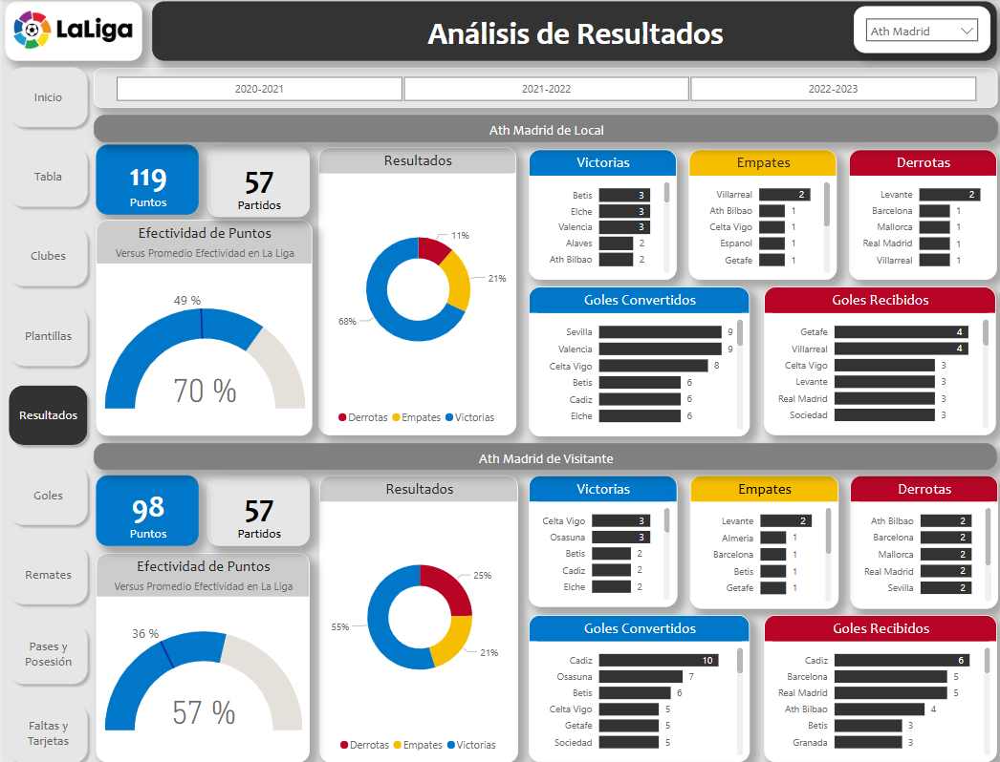
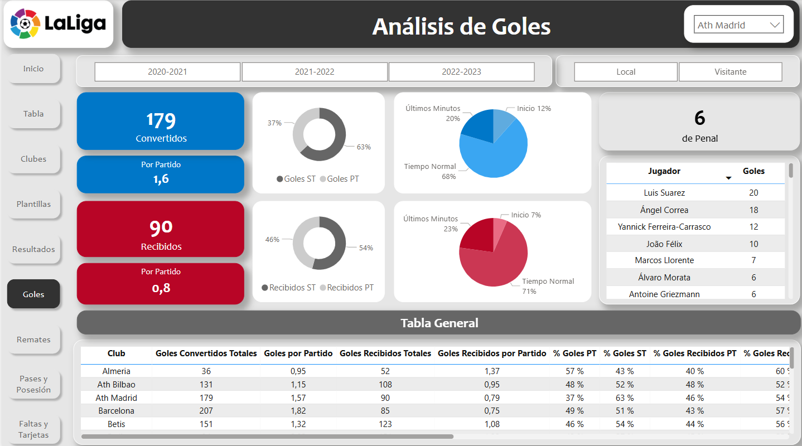

# Portfolio Profesional de Franco Salas 
Este git contiene muestras del portfolio profesional en Power BI de Franco Salas.
Todos los clientes aceptaron la inclusión de sus tableros en este espacio. 
Ante todo, se resguardara la seguridad e integridad de los datos aun finalizado el vínculo laboral.

## Contiene 
1. Modelo Semantico y Tablero de La Liga Española con datos obtenidos de una Api de DB Sports:

2. Tablero de Seguimiento Personal con datos provenientes desde LongoMatch.
3. Informe Estadístico de Rendimiento Deportivo con datos provenientes de WyScout:
4. Tablero Selección Argentina Femenina con datos provenientes desde LongoMatch.
B) Archivo txt con link a Tableros para su visualización.

# Franco Salas Professional Portfolio
This repository contains some samples of Franco Salas's professional portfolio.
All clients have agreed to the inclusion of their dashboards in this space.
Above all, the security and integrity of the data will be safeguarded even after the termination of the employment relationship.

## Contents
A) PDF files of the following dashboards:
  1. La Liga Española Dashboard with data sourced from a DB Sports API.
  2. Personal Tracking Dashboard with data sourced from LongoMatch.
  3. Statistical Report on Sports Performance with data sourced from WyScout.
  4. Argentina Women's National Team Dashboard with data sourced from LongoMatch.
B) txt file with links to dashboards for viewing purposes.
