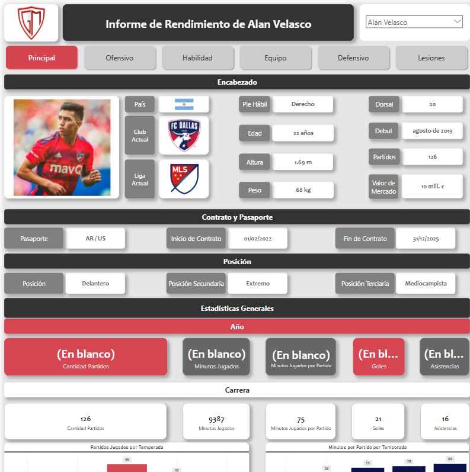
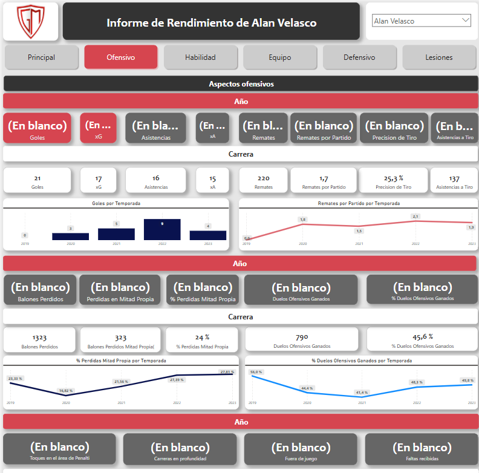
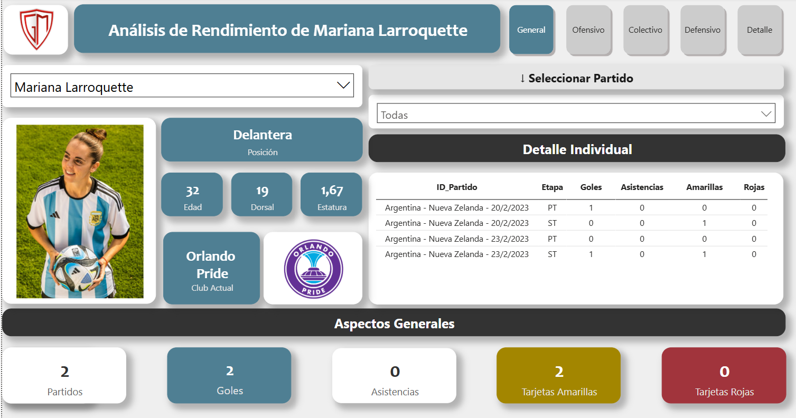
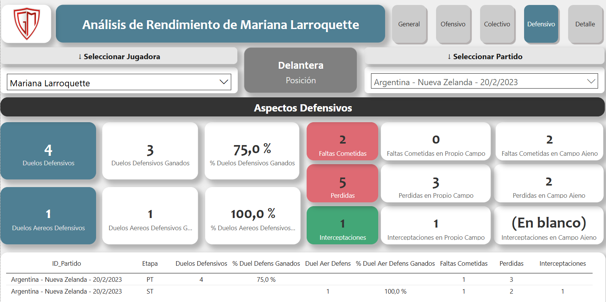

# Portfolio Profesional de Franco Salas 
Este repositorio contiene muestras del portfolio profesional en Power BI de Franco Salas.
*Todos los clientes aceptaron la inclusión de sus tableros en este espacio.*
*Ante todo, se resguardará la seguridad e integridad de los datos aun finalizado el vínculo laboral.*

## Contiene 
### 1. Modelo Semántico y Tablero de [La Liga Española](https://app.powerbi.com/view?r=eyJrIjoiYWNkZGU4MDEtNTU5Yi00OWFlLTkyODAtMzJkN2M3YmY0OTU4IiwidCI6Ijg1MjI2NjJhLTVkYTctNGE1Zi05ZDM0LWFmNzAzNTM3NzIyZCIsImMiOjR9) con datos obtenidos de una Api de DB Sports:

### 2. PDF con [Solución de Seguimiento Personal](https://github.com/fransalasdat/portfolio/blob/main/2_Solucion_GiocaMeglio_TSP/2.%20Solucion%20GiocaMeglio%20TSP.pdf) con datos provenientes desde LongoMatch.
### 3. Modelo Semántico y Tablero de [Informe Estadístico de Rendimiento Deportivo](https://app.powerbi.com/view?r=eyJrIjoiZjU2ZGE4NzUtMDVlNi00ZGI4LTlmNGEtMmYwNDFhODNiZDc4IiwidCI6Ijg1MjI2NjJhLTVkYTctNGE1Zi05ZDM0LWFmNzAzNTM3NzIyZCIsImMiOjR9) con datos provenientes de WyScout:

### 4. Modelo Semántico y Tablero [Selección Argentina Femenina](https://app.powerbi.com/view?r=eyJrIjoiMGZmNjcyNjItOGE4NS00ZWZiLTg5MzItNzQyM2JiOWEwZGNiIiwidCI6Ijg1MjI2NjJhLTVkYTctNGE1Zi05ZDM0LWFmNzAzNTM3NzIyZCIsImMiOjR9) con datos provenientes desde LongoMatch.

